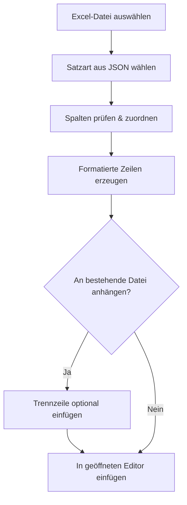
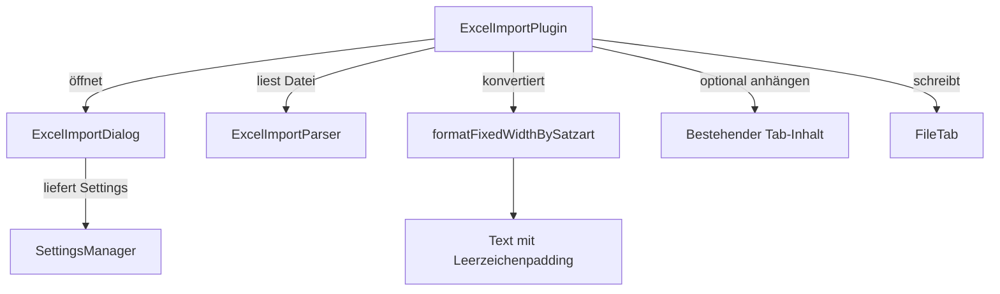

# MainframeMate – Datenimport aus Excel in Mainframe-Formate

MainframeMate hilft dir dabei, strukturierte Daten z. B. aus Excel-Dateien in festformatierte Textdateien zu konvertieren und optional direkt auf einen Mainframe-Host zu laden. Dabei unterstützt dich das Tool mit einem intuitiven Dialog und einem flexiblen Layoutsystem, das du über eine einfache JSON-Datei selbst konfigurieren kannst.

---

## Übersicht der Import-Logik



---

## Excel-Import und Satzarten-Konfiguration

Damit der Import korrekt funktioniert, müssen sogenannte *Satzarten* definiert werden. Diese beschreiben:

* welche Spalten relevant sind,
* an welcher Position in der Zieldatei sie stehen sollen,
* ob an bestehende Inhalte angehängt werden soll,
* und (optional) wo die Datei gespeichert werden soll.

### Beispiel-Satzarten-Datei (JSON)

```json
{
  "KUNDEN": {
    "meta": {
      "append": true,
      "pfad": "USR.DATA.KUNDEN"
    },
    "felder": [
      { "name": "NAME",    "pos": 1,  "len": 20 },
      { "name": "ALTER",   "pos": 21, "len": 3  },
      { "name": "E-Mail",  "pos": 25, "len": 25 },
      { "name": "AKTIV",   "pos": 50, "len": 5  }
    ]
  },
  "PRODUKTE": {
    "meta": {
      "append": false,
      "pfad": "USR.DATA.PRODUKTE"
    },
    "felder": [
      { "name": "NR",     "pos": 1,  "len": 5  },
      { "name": "TITEL",  "pos": 7,  "len": 30 },
      { "name": "PREIS",  "pos": 38, "len": 10 }
    ]
  }
}
```

### Erklärungen:

| Schlüssel     | Beschreibung                                                               |
| ------------- | -------------------------------------------------------------------------- |
| `felder`      | Liste der Felddefinitionen für eine Zeile                                  |
| `name`        | Spaltenüberschrift in Excel (Groß-/Kleinschreibung wird ignoriert)         |
| `pos`         | Startposition des Feldes (1-basiert)                                       |
| `len`         | Länge des Feldes (auffüllend mit Leerzeichen)                              |
| `meta.append` | Soll der Inhalt an bestehende Datei angehängt werden? (true/false)         |
| `meta.pfad`   | Optionaler Hinweis, wohin der Import z. B. auf dem Mainframe erfolgen soll |

Zusätzlich unterstützt der Importdialog eine **Trennzeile**, die automatisch eingefügt wird, wenn die Option "Anhängen" aktiv ist. Diese lässt sich in den Einstellungen zentral vorgeben und wird bei aktivierter Append-Option mitgespeichert.

---

## Hinweise zur Bedienung

* Wird eine Satzart mit `"append": true` gewählt, ist die entsprechende Checkbox im Dialog automatisch aktiviert.
* Die Trennzeile wird **nur dann gespeichert**, wenn auch tatsächlich "Anhängen" aktiviert war.
* Beim Deaktivieren von "Anhängen" bleibt die Trennzeile sichtbar (ausgegraut), wird aber nicht gespeichert.
* Der Dateiname für neue Tabs lautet standardmäßig einfach `import` (ohne `.csv`), damit der Inhalt auch zu COBOL passt.

---

## Architekturübersicht (technisch)



## Erweiterte Funktionen (seit Version 1.1)

**MainframeMate** wurde um eine Reihe hilfreicher Editor- und Konfigurationsfunktionen erweitert:

### 🎨 Farbliche Hervorhebung von Feldern

- Jeder importierte Datenblock wird auf Basis der Satzart farblich markiert.
- Statische Werte (`"value"`) erscheinen standardmäßig in **grau**.
- Optional lassen sich Farben pro Feldname in den allgemeinen **Einstellungen** überschreiben:
  - `"Feldname"` → Name des Felds (Groß-/Kleinschreibung wird ignoriert)
  - `"Farbe"` → Farbwert als HEX-Code (`#RRGGBB`)
- Die Farbüberschreibungen werden im Einstellungsdialog gepflegt.
- Doppelklick auf die Farbzelle öffnet einen **Color Picker**.

### 🧾 Mehrzeilige Satzarten mit `"row"`

- Felder können über das Attribut `"row"` in **mehrere Zeilen** verteilt werden.
- `"row"` ist optional, Standardwert: `1`.
- Auch `"value"`-Felder ohne Excel-Spalte können in beliebige Zeilen geschrieben werden.
- Beispiel:

```json
{ "name": "NAME", "pos": 1, "len": 20 },
{ "value": "Alter", "pos": 21, "len": 5, "row": 2 },
{ "name": "ALTER", "pos": 30, "len": 3, "row": 2 },
{ "name": "AKTIV", "pos": 10, "len": 1, "row": 3 }
```

### 🛠 Erweiterte Editor-Einstellungen

- Editor-Schriftart und -größe konfigurierbar.
- Zeilenende beim Speichern: `LF`, `CRLF`, oder `NONE`.
- Optional eine **vertikale Linie** z. B. bei Spalte 80 (in den allgemeinen Einstellungen).
- Inhalte werden farbig hervorgehoben, wenn Satzarten beim Import verwendet werden.

### 🧩 Farb-Overrides in JSON (experimentell)

Im JSON können alternativ zu den globalen Einstellungen auch Farbwerte pro Feld festgelegt werden:

```json
{ "name": "ALTER", "pos": 21, "len": 3, "color": "#FFA500" }
```

Die Konfiguration in den allgemeinen Einstellungen überschreibt die Farbe in der Satzart nur, wenn dort explizit hinterlegt.
Namenlose felder (value) können ebenfalls mit einer Farbe versehen. Dafür kann als Bezeichner CONST_ und dann der Inhalt der value-Angabe verwenden werden.
Beispielsweise steht in value 01, dann wird CONST_01 als Bezeichner verwendet.

### Künstliche Intelligenz

MainframeMate nutzt KI-gestützte Funktionen, um die Benutzererfahrung zu verbessern. Diese Funktionen sind experimentell und können in den Einstellungen aktiviert werden. Sie bieten Unterstützung bei der Satzartenerstellung und der Datenvalidierung.
Das Modell dafür ist lokal und benötigt keine Internetverbindung. Es muss allerdings einmalig von extern bezogen werden, geeignet ist z.B. das Mistral-7B-Modell von Hugging Face. Bitte auf das Format achten, das Modell muss als grun-quantisiertes GGUF-Modell vorliegen.
Für reine CPU-Beschleunigung kann der interne Treiber, basierend auf llama.cpp, verwendet werden. Für GPU-Beschleunigung muss der Treiber entweder neu kompiliert werden oder es wird auf OLLAMA ausgewichen, das ebenfalls vollständig unterstützt wird und bei der Modellauswahl auch freier ist.

---

### Plugins

Um ein Plugin zu nutzen muss es unter "<userHome>.mainframemate/plugins" liegen (wo auch die Settings sind). In Gradle reicht es aus diesen Task zu starten:

```plugins > excelimport > Tasks > build > build```

Das JAR wird dann automatisch in das richtige Verzeichnis kopiert. Für andere Plugins verfährt man ähnlich.

---

## Für Entwickler

### Tools.jar
Da unter Java 8 noch keine JShell zur Verfügung steht, muss zur Compilierung von Scripten zur Laufzeit der der Java-Compiler eingebunden werden.
Damit das klappt, braucht Gradle den Pfad zur Tools.jar. Es findet die über die Umgebungsvariable JAVA_HOME. Falls die falsch gesetzt ist, kann sie auch temporär während einer PowerShell Session wie folgt gesetzt werden:
```
$env:JAVA_HOME = "C:\Program Files\Java\latest\jre-1.8"
```
oder falls das nicht klappt direkt zur aktuellen JRE z.B.:
```
$env:JAVA_HOME = "C:\Oracle\JDK\8u321"
```

Hinweis: Ab Java 9 muss der Code auf die JShell umgestellt werden. Das wurde bereits getestet und funktioniert problemlos!

### Proxy-Konfiguration

#### Hintergrund: warum es eigene Skripte gibt

Unter Windows ist häufig **„Proxy automatisch erkennen / Setupskript (WPAD/PAC) verwenden“** konfiguriert. Browser können das problemlos auswerten (PAC ist JavaScript und entscheidet je nach Ziel-URL, oft inkl. Fallback-Proxy-Ketten).

**Gradle (Java 8) und Git übernehmen diese PAC-Logik aber nicht automatisch**. Ohne explizite Proxy-Angaben sieht Java oft nur `DIRECT` – oder man landet (bei naivem PAC-Parsing) beim falschen Proxy/Port.

Die aktuelle Lösung ist deshalb bewusst so gebaut:

- **Kein PAC-Parsing** (kein Regex/JavaScript-Parser).
- Stattdessen wird der **effektive Proxy für eine konkrete URL** über die Windows-Proxy-Auflösung ermittelt.
- Ergebnis: **robuster bei dynamischen PACs**, bei Fallback-Listen und bei Änderungen im Netzwerk – und keine „zufällig erste PROXY-Zeile“ mehr.

---

#### Automatische Proxy-Konfiguration für Gradle (WPAD/PAC)

Projekt bauen (lädt Abhängigkeiten in den Gradle-Cache):

```
./gradlew --stop
./gradlew assemble --init-script proxy-init.gradle
```

Was passiert dabei?

- `proxy-init.gradle` ruft `get-proxy-from-pac.ps1` mit einer Test-URL (Gradle Plugin Portal) auf
- und setzt daraus **`http(s).proxyHost` / `http(s).proxyPort`** für die JVM.
- Danach kannst du das Projekt wie gewohnt in IntelliJ starten/debuggen.

**Tipp:** Wer sich das wiederholte Ausführen sparen möchte, kann `proxy-init.gradle` global unter  
`%USERPROFILE%\.gradle\init.gradle` ablegen (Datei muss `init.gradle` heißen).

#### Proxy-Konfiguration für GIT-Versionsverwaltung

Da GIT analog zu Gradle die Proxy Konfiguration aus Windows nicht automatisch übernimmt, muss einmalig für dem ersten Push folgendes Script ausgeführt werden:

Einmalig (oder nach Proxy-/Netzwerkwechsel) ausführen:
```
.\configure-git-proxy.ps1
```

Das Skript

- ermittelt den effektiven Proxy passend zur **Remote-URL** (Standard: `origin`)
- und setzt in der globalen Git-Konfiguration `http.proxy` und `https.proxy`.

Proxy wieder entfernen (DIRECT):

```
.\configure-git-proxy.ps1 -Unset
```

Warum ist das besser als die alte Lösung?

- **PAC-Dateien sind dynamisch** (JavaScript-Logik pro URL, oft mit Fallbacks).  
  Ein Parser/Regex, der „die erste PROXY-Zeile“ nimmt, kann auf einen **nicht erreichbaren** Proxy/Port zeigen.
- Die neue Lösung nutzt **Windows’ Proxy-Entscheidung** für die konkrete Ziel-URL und ist damit stabiler.
- Außerdem ist sie **PowerShell 5.1 kompatibel** (keine PS7-Operatoren wie `??`).

---

#### Proxy-Konfiguration für IntelliJ IDEA (optional)

IDEA kann den Proxy für eigene HTTP-Aufrufe meist selbst erkennen:

Settings → Appearance & Behavior → System Settings → HTTP Proxy

- **Auto-detect proxy settings** (empfohlen)  
  oder
- manuell, falls Auto-Detect im Netz nicht ausreicht.

Hinweis: Diese IDE-Einstellung ersetzt nicht die CLI-Konfiguration für Gradle/Git – sie betrifft primär IDEA selbst.


### KI-Unterstützung
Der gebündelte KI-Treiber kann mittels CMAKE und gcc / g++ oder ggf. mittels des MSVC-Plugins von Clang / LLVM in VS Code kompiliert werden.
Der neuen Hashwert ermittelt sich dann am leichtesten mittels:
##### Windows (PowerShell)
```powershell
Get-FileHash .\driver.exe -Algorithm SHA256
```
#### Linux/macOS
```bash
sha256sum driver.exe
```

(Linux wird aktuell nicht unterstützt - wurde nicht getestet)

---

## Third-party components used in this project:

- llama.cpp (MIT License)
  https://github.com/ggerganov/llama.cpp
  See: /llama/LICENSE-LLAMACPP.txt