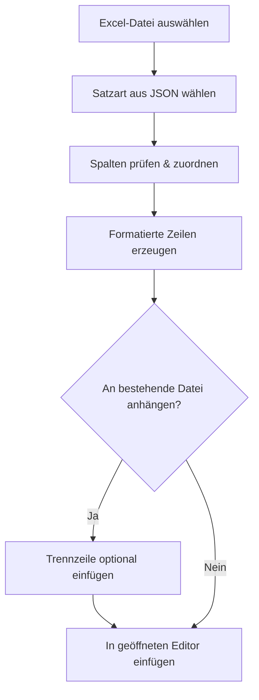
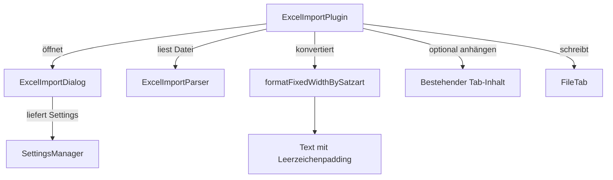

# MainframeMate – Datenimport aus Excel in Mainframe-Formate

MainframeMate hilft dir dabei, strukturierte Daten z. B. aus Excel-Dateien in festformatierte Textdateien zu konvertieren und optional direkt auf einen Mainframe-Host zu laden. Dabei unterstützt dich das Tool mit einem intuitiven Dialog und einem flexiblen Layoutsystem, das du über eine einfache JSON-Datei selbst konfigurieren kannst.

---

## Übersicht der Import-Logik



---

## Excel-Import und Satzarten-Konfiguration

Damit der Import korrekt funktioniert, müssen sogenannte *Satzarten* definiert werden. Diese beschreiben:

* welche Spalten relevant sind,
* an welcher Position in der Zieldatei sie stehen sollen,
* ob an bestehende Inhalte angehängt werden soll,
* und (optional) wo die Datei gespeichert werden soll.

### Beispiel-Satzarten-Datei (JSON)

```json
{
  "KUNDEN": {
    "meta": {
      "append": true,
      "pfad": "USR.DATA.KUNDEN"
    },
    "felder": [
      { "name": "NAME",    "pos": 1,  "len": 20 },
      { "name": "ALTER",   "pos": 21, "len": 3  },
      { "name": "E-Mail",  "pos": 25, "len": 25 },
      { "name": "AKTIV",   "pos": 50, "len": 5  }
    ]
  },
  "PRODUKTE": {
    "meta": {
      "append": false,
      "pfad": "USR.DATA.PRODUKTE"
    },
    "felder": [
      { "name": "NR",     "pos": 1,  "len": 5  },
      { "name": "TITEL",  "pos": 7,  "len": 30 },
      { "name": "PREIS",  "pos": 38, "len": 10 }
    ]
  }
}
```

### Erklärungen:

| Schlüssel     | Beschreibung                                                               |
| ------------- | -------------------------------------------------------------------------- |
| `felder`      | Liste der Felddefinitionen für eine Zeile                                  |
| `name`        | Spaltenüberschrift in Excel (Groß-/Kleinschreibung wird ignoriert)         |
| `pos`         | Startposition des Feldes (1-basiert)                                       |
| `len`         | Länge des Feldes (auffüllend mit Leerzeichen)                              |
| `meta.append` | Soll der Inhalt an bestehende Datei angehängt werden? (true/false)         |
| `meta.pfad`   | Optionaler Hinweis, wohin der Import z. B. auf dem Mainframe erfolgen soll |

Zusätzlich unterstützt der Importdialog eine **Trennzeile**, die automatisch eingefügt wird, wenn die Option "Anhängen" aktiv ist. Diese lässt sich in den Einstellungen zentral vorgeben und wird bei aktivierter Append-Option mitgespeichert.

---

## Hinweise zur Bedienung

* Wird eine Satzart mit `"append": true` gewählt, ist die entsprechende Checkbox im Dialog automatisch aktiviert.
* Die Trennzeile wird **nur dann gespeichert**, wenn auch tatsächlich "Anhängen" aktiviert war.
* Beim Deaktivieren von "Anhängen" bleibt die Trennzeile sichtbar (ausgegraut), wird aber nicht gespeichert.
* Der Dateiname für neue Tabs lautet standardmäßig einfach `import` (ohne `.csv`), damit der Inhalt auch zu COBOL passt.

---

## Architekturübersicht (technisch)



---

### Automatische Proxy-Konfiguration per WPAD/PAC-Datei

Wenn unter Windows ein Setupskript mit URL für das Netzwerk hinterlegt ist, muss das Projekt wie folgt über die PowerShell gebaut werden:

```
./gradlew assemble --init-script proxy-init.gradle
```

Dadurch werden die nötigen Dependencies in den Gradle-Cache geladen. Anschließen kann das Projekt auch einfach wie gewohnt in IntelliJ gestartet und dedebugged werden. Dazu einfach die Play-Taste neben der main anklicken. Bei Änderungen der Dependencies muss der o.g. Befehl im Terminal allerdings immer wieder erneut ausgeführt werden.

**Tipp:** Wer sich das wiederholte Ausführen im Terminal sparen möchte, kann die Datei `proxy-init.gradle` auch global unter `%USERPROFILE%\.gradle\init.gradle` ablegen. Damit wird die automatische Proxy-Konfiguration dauerhaft für alle Gradle-Projekte übernommen – unabhängig davon, wie sie gestartet werden. (Die Datei muss zwingend in init.gradle umbenannt werden, ansonsten funktioniert es nicht.)

### Proxy-Konfiguration für GIT-Versionsverwaltung

Da GIT analog zu Gradle die Proxy Konfiguration aus Windows nicht automatisch übernimmt, muss einmalig für dem ersten Push folgendes Script ausgeführt werden:

```
.\configure-git-proxy.ps1
```

Hierbei wird ein minimalistischer JavaScript Parser verwendet, um an die notwendigen Informationen aus der PAC-Datei zu gelangen.

### Proxy-Konfiguration für IDEA (funktioniert aber nicht für Gradle und GIT)

Im obigen Fall muss auch IDEA angepasst werden, damit die GIT-Versionsverwaltung wie gewohnt funktioniert. Das geht am einfachsten wie folgt:
Settings → Appearance & Behavior → System Settings → HTTP Proxy:

* steht auf Auto-detect proxy settings
* oder manuell mit den richtigen Daten (falls "auto" nicht ausreicht die Box für den Link anhaken)
  Die URL für die halbautomatische Einstellung bekommt man über ein Klick auf den blauen Link zu den Systemeinstellugen, die URL dort einfach kopieren.
