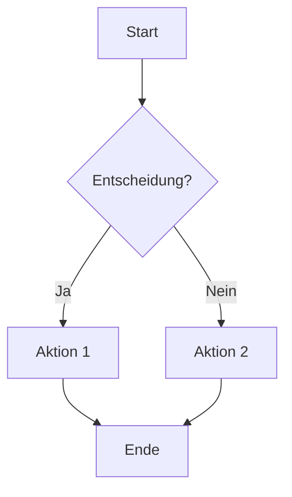
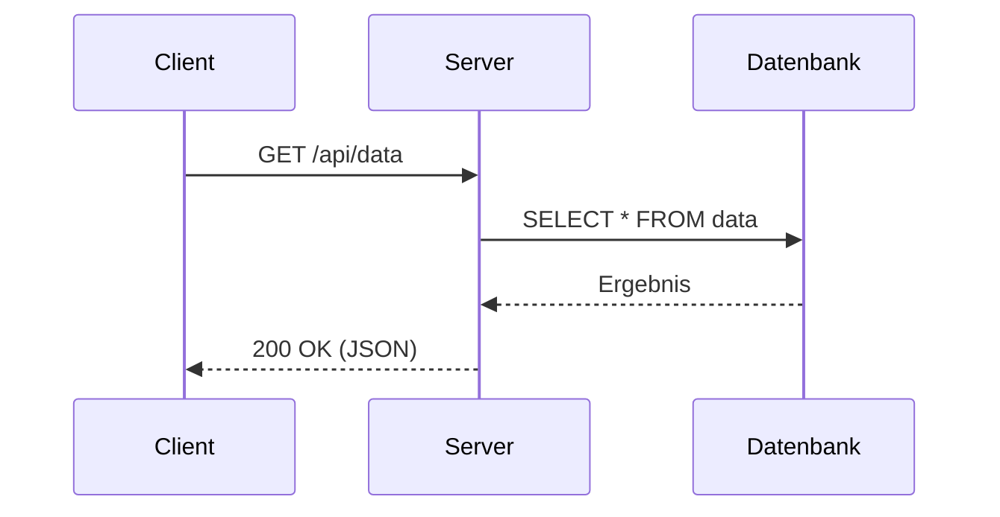
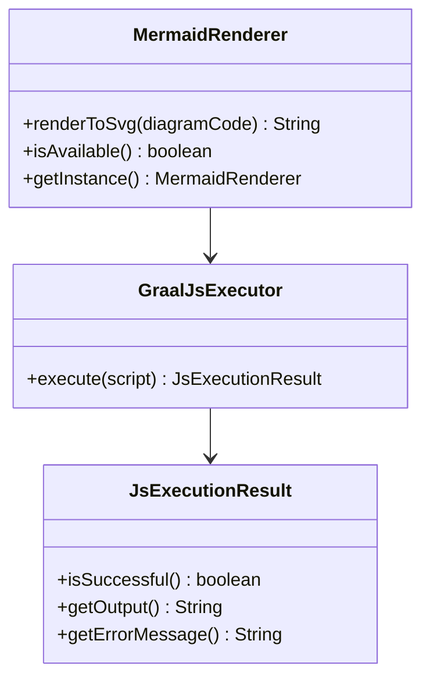
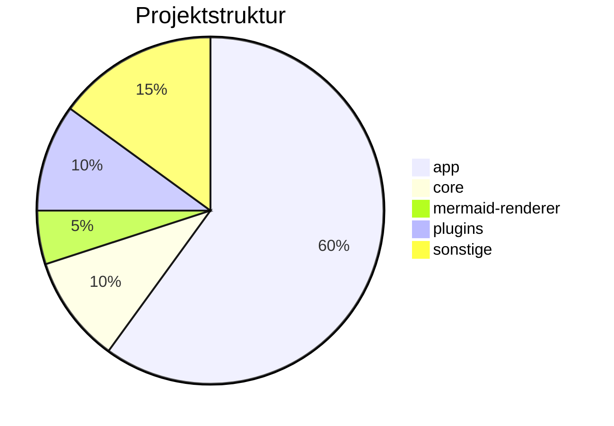

# Mermaid Diagrams Test

Dies ist ein Test-Dokument mit verschiedenen Mermaid-Diagrammen.

## Flowchart

Ein einfaches Flowchart:



## Sequenzdiagramm

Kommunikation zwischen Client und Server:



## Normaler Code-Block

Zum Vergleich — ein normaler Code-Block (kein Mermaid):

```java
public class HelloWorld {
    public static void main(String[] args) {
        System.out.println("Hello!");
    }
}
```

## Klassendiagramm



## Pie Chart



## Text nach den Diagrammen

Alle Diagramme oben sollten als **gerenderte SVG-Bilder** statt als Code-Blöcke angezeigt werden.

